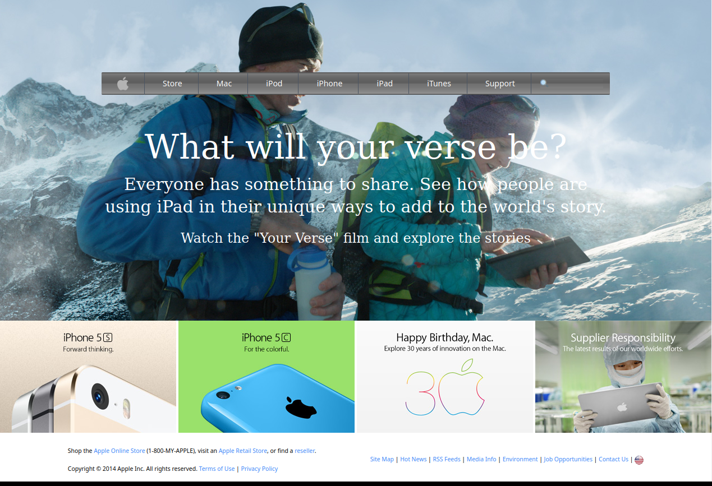

# Readme
# Apple Homepage from 2014!

## Overview

So... parts of The Odin Project's HTML curriculum were a bit stale...
The project suggestion was to "clone the website of the most design-forward companies in the world"... albeit circa 2014! [This](https://web.archive.org/web/20140301004610/http://www.apple.com/) is what it looked like.  The Odin Project was emphasizing working with background photos as well as gradients.  Not wanting to be lazy, I complied.  Kind-of.  I chose to utilize Tailwind CSS to get some more practice with that, and to be honest I got kind of bored and left the webpage incomplete, at 99%.  But it's almost there!  Take a look!

### Challenge

The design requirements from The Odin Project are detailed
[here](https://www.theodinproject.com/paths/full-stack-javascript/courses/html-and-css/lessons/building-with-backgrounds-and-gradients)

### Screenshot

  

### Links

- [Live site](https://mattdimicelli.github.io/apple_homepage_2014/)
- [Repo](https://github.com/mattdimicelli/apple_homepage_2014)

## My process

### Built with

- Tailwind CSS
  - I made some custom styles as well
- Semantic HTML
- Webfonts

### What I learned

To be honest I probably didn't learn too much here, but building a page (and paying attention to detail) is like going to the gym... it's good for you!  And I believe that it makes me a stronger coder.  

